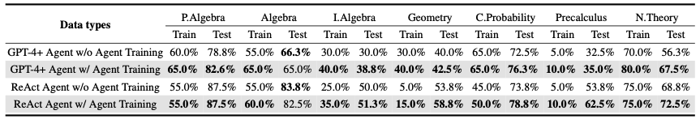
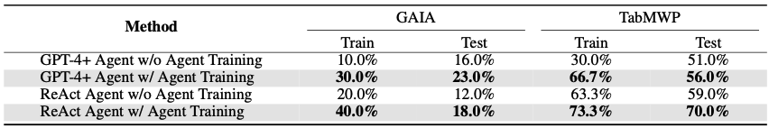
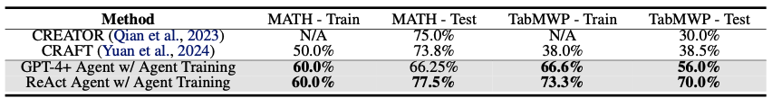

# Training Language Model Agents without Modifying Language Models

## Introduction

This repository is the implementation of ICML 2024 submission **Training Language Model Agents without Modifying Language Models**. 
This version of the code is made to facilitate the peer review of the ICML 2024 submission of our paper. 
We plan to release the code accompanying the formal publication of this paper. 

## Datasets


- MATH [1]: MATH is a dataset of 12,500 challenging competition mathematics problems. Each problem in MATH has a full step-by-step solution which can be used to teach models to generate answer derivations and explanations.

- GAIA [2]: The GAIA dataset is dedicated to evaluating the LLM agents in solving unambiguous real-world questions. It contains 466 carefully crafted questions and their answer, along with the associated design methodology.

- TabMWP [3]: The TabMWP dataset evaluates agents in processing structured data in tables, where each data sample contains one table and one question in natural language. It contains 38,431 open-domain grade-level problems that require mathematical reasoning on both textual and tabular data.

## Experiments

### **Requirements**

To install requirements:
```setup
conda install --yes --file requirements.txt
```

### **How to run** 

- MATH

	```python
	# Get results of GPT-4+ agent without training
	python MATH/main_GPT.py  --math_type 'algebra'

	# Get results of GPT-4+ agent with training
	python MATH/main_GPT.py  --math_type 'algebra' --epoch_num 0

	# Get results of React agent without training
	python MATH/main_React.py --math_type 'algebra'

	# Get results of React agent with training
	python MATH/main_React_op.py --math_type 'algebra'

	```

- GAIA

	```python
	# Get results of both GPT-4+ agent without training and GPT-4+ agent with training
	python GAIA/main_gpt.py 

	# Get results of both React agent without training and React agent with training
	python GAIA/main_React.py

	```

- TabMWP

	```python
	# Get results of both GPT-4+ agent without training and GPT-4+ agent with training
	python TabMWP/main_gpt.py 

	# Get results of both React agent without training and React agent with training
	python TabMWP/main_React.py

	```


## Results 

1. **Results on different data types of MATH**

    <p float="left">
    
    </p>


2. **Results on GAIA and TabMWP**

    <p float="left">
    
    </p>


3. **Results - Comparing with Tool-creation methods**  

    <p float="left">
    
    </p>


## References
[1]: Hendrycks, D., Burns, C., Kadavath, S., Arora, A., Basart, S., Tang, E., Song, D., and Steinhardt, J. Measuring mathematical problem solving with the MATH dataset. In NeurIPS, 2021.

[2]: Mialon, G., Fourrier, C., Swift, C., Wolf, T., LeCun, Y., and Scialom, T. Gaia: a benchmark for general ai assistants. arXiv preprint arXiv:2311.12983, 2023.

[3]: Lu, P., Qiu, L., Chang, K.-W., Wu, Y. N., Zhu, S.-C., Ra- jpurohit, T., Clark, P., and Kalyan, A. Dynamic prompt learning via policy gradient for semi-structured mathe- matical reasoning. In ICLR, 2023.